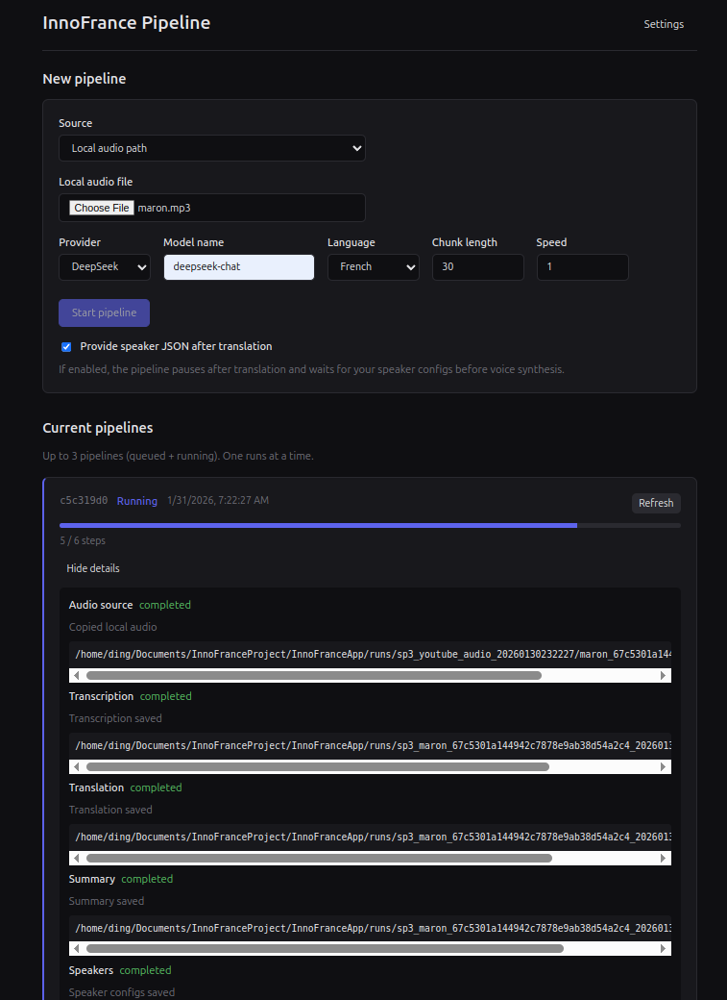
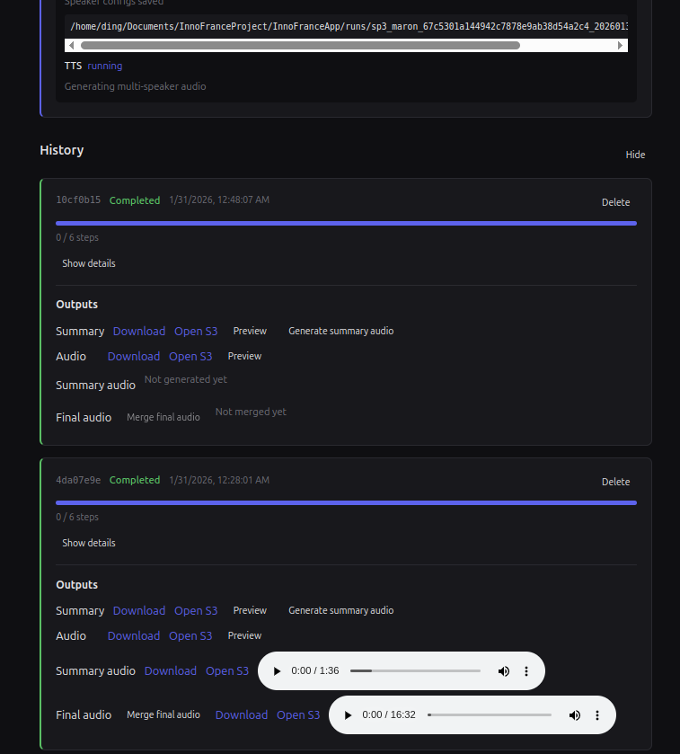
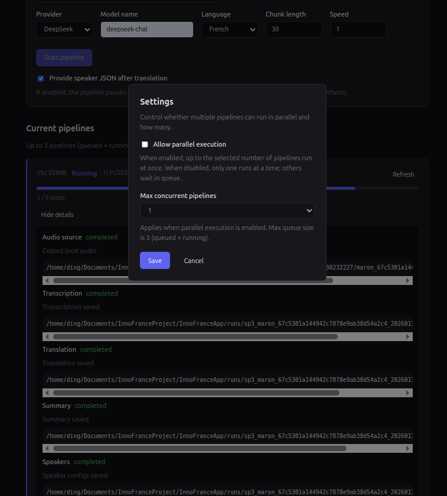

# InnoFranceApp

End-to-end pipeline that turns a YouTube link (or audio URL/path) into:

- A Chinese summary text (`.txt`)
- A Chinese multi-speaker audio (`.wav`) generated from the translated transcript

The app orchestrates multiple MCP services:

- **InnoFranceYTAudioExtractor** — YouTube audio download
- **InnoFranceASRService** — ASR and speaker diarization
- **InnoFranceTranslateAGENT** — translation and summary
- **InnoFranceVoiceGenerateAgent** — TTS voice clone

## Features

- **CLI**: Run a single pipeline from the command line.
- **Web UI**: Start and monitor up to three pipelines from a browser. Pipelines are queued; one runs at a time by default, with an option to run up to three in parallel.
- **Progress**: Per-pipeline step progress and optional detailed logs (audio source → transcription → translation → summary → speakers → TTS).
- **Artifacts**: Download and preview summary text and generated audio for completed runs.

## Docs

- User guide (中文): `docs/user_guide_zh.md`
- User guide (English): `docs/user_guide_en.md`
- Installation (中文): `docs/installation_zh.md`
- Installation (English): `docs/installation_en.md`
- Developer guide (中文): `docs/developer_zh.md`
- Developer guide (English): `docs/developer_en.md`

## UI Preview





## Project Structure

```
InnoFranceApp/
├── config.json              # Default service and path config
├── requirements.txt         # Python dependencies
├── README.md
├── inno_france_app/
│   ├── __init__.py
│   ├── cli.py               # CLI entrypoint
│   ├── server.py            # API server entrypoint
│   ├── config.py            # Config loading
│   ├── settings.py          # Environment-based settings
│   ├── pipeline.py          # Pipeline logic and progress hooks
│   ├── mcp_clients.py       # MCP client (stdio/SSE)
│   ├── speaker_profiles.py  # Speaker config generation
│   ├── text_utils.py        # Text normalization
│   └── api/
│       ├── __init__.py
│       ├── app.py           # FastAPI app and routes
│       ├── queue.py         # Pipeline queue and job state
│       └── schemas.py       # Pydantic models
└── frontend/                # React + Vite UI
    ├── package.json
    ├── vite.config.ts
    ├── index.html
    └── src/
        ├── main.tsx
        ├── App.tsx
        ├── api.ts           # API client
        ├── types.ts
        ├── index.css
        └── components/
            ├── PipelineForm.tsx
            ├── JobCard.tsx
            └── SettingsPanel.tsx
```

## Workflow (Pipeline Steps)

1. **Audio source** — Download from YouTube (MP3), copy local file, or fetch from audio URL.
2. **Transcription** — ASR with speaker diarization; output saved as `transcript.json`.
3. **Translation** — Translate transcript to Chinese with speaker tags; `translated.txt`.
4. **Summary** — Generate Chinese summary; final summary `.txt` in output dir.
5. **Speakers** — Build speaker configs from translated text; `speakers.json`.
6. **TTS** — Generate multi-speaker Chinese audio; final `.wav` in output dir.

Outputs use incremental naming: `sp{n}_<base>.txt`, `sp{n}_<base>.wav`, etc.

## Prerequisites

- Python 3.10+
- `ffmpeg` on PATH
- LLM provider credentials for `InnoFranceTranslateAGENT`
- Model paths for ASR and TTS services

Install ffmpeg (Ubuntu/Debian):

```bash
sudo apt update
sudo apt install -y ffmpeg
```

## Install

Create a venv and install this app:

```bash
python3 -m venv .venv
source .venv/bin/activate   # Windows: .venv\Scripts\activate
pip install -r requirements.txt
```

Install each MCP service dependency (run once from repo root):

```bash
pip install -r InnoFranceYTAudioExtractor/requirements.txt
pip install -r InnoFranceASRService/requirements.txt
pip install -r InnoFranceTranslateAGENT/requirements.txt
pip install -r InnoFranceVoiceGenerateAgent/requirements.txt
```

## Quick Start

### CLI (single pipeline)

Example:

```bash
python3 -m inno_france_app.cli \
  --youtube-url "https://www.youtube.com/watch?v=WRvWLWfv4Ts" \
  --provider openai \
  --model-name gpt-4o-mini \
  --language fr \
  --chunk-length 30 \
  --speed 1.0
```

With audio URL or local path:

```bash
python3 -m inno_france_app.cli --audio-url "https://example.com/audio.mp3" --provider openai --model-name gpt-4o-mini
python3 -m inno_france_app.cli --audio-path "/path/to/audio.wav" --provider openai --model-name gpt-4o-mini
```

All CLI parameters:

- `--youtube-url`: YouTube video URL. Use exactly one input source.
- `--audio-url`: Direct audio URL (`.mp3` or `.wav`).
- `--audio-path`: Local audio path (`.mp3` or `.wav`).
- `--provider`: LLM provider for translation/summary (default: `openai`).
- `--model-name`: LLM model name (required).
- `--language`: ASR language code (default: `fr`).
- `--chunk-length`: ASR chunk length in seconds (default: `30`).
- `--speed`: TTS playback speed (default: `1.0`).
- `--yt-cookies-file`: Path to a YouTube `cookies.txt` file (optional).
- `--yt-cookies-from-browser`: Browser name for yt-dlp cookies (e.g. `chrome`).
- `--yt-user-agent`: Custom User-Agent for YouTube extraction.
- `--yt-proxy`: Proxy URL for YouTube extraction.
- `--config`: Path to config JSON to override `config.json`.

### Web UI (queue, progress, download/preview)

1. Start the API server:

```bash
python3 -m inno_france_app.server --host 127.0.0.1 --port 8000
```

Optional: `--config /path/to/config.json`, `--reload` for development.

2. Start the frontend (from project root):

```bash
cd frontend
npm install
npm run dev
```

3. Open http://localhost:5173. The frontend proxies `/api` to the backend (see `frontend/vite.config.ts`).

- **New pipeline**: Choose source (YouTube URL, audio URL, or local path), set provider/language/speed, then **Start pipeline**. Up to three pipelines can be queued or running; extra submissions are rejected until a slot is free.
- **Settings**: Toggle **Allow parallel execution** and set **Max concurrent pipelines** (1–3). When parallel is off, only one pipeline runs at a time; others wait.
- **Progress**: Each job shows status (Queued / Running / Completed / Failed), a step progress bar, and a **Show details** toggle for step-by-step logs.
- **Completed jobs**: Use **Download** for summary `.txt` and audio `.wav`, and **Preview** to view text or play audio in the browser.

## API Overview

| Method | Path | Description |
|--------|------|-------------|
| GET | `/api/settings` | Get parallel flag and max concurrent |
| PATCH | `/api/settings` | Update `parallel_enabled`, `max_concurrent` (JSON body) |
| POST | `/api/pipeline/start` | Start a pipeline (JSON body: `youtube_url` or `audio_url` or `audio_path`, plus `provider`, `language`, etc.) |
| GET | `/api/pipeline/jobs` | List all jobs |
| GET | `/api/pipeline/jobs/{job_id}` | Get job status and result |
| GET | `/api/pipeline/jobs/{job_id}/stream` | SSE stream of step progress events |
| GET | `/api/artifacts/download?path=...` | Download file (path relative to output or runs dir) |
| GET | `/api/artifacts/preview/summary?path=...` | Preview summary text |
| GET | `/api/artifacts/preview/audio?path=...` | Preview audio (stream) |

## Output Artifacts

- **Run artifacts**: `InnoFranceApp/runs/sp{n}_<base>_<timestamp>/`
  - `audio.mp3` (source)
  - `transcript.json`
  - `translated.txt`
  - `summary.txt`
  - `speakers.json`
  - `audio.wav` (dialogue)
  - `summary_audio.wav` (summary TTS)
  - `final_audio.wav` (merged output)

## Configuration

### .env file

The app loads environment variables from a `.env` file in the current working directory (when you run the CLI or server). Copy the template and edit:

```bash
cp env.example .env
```

Then set values in `.env` for paths, model paths, and API keys (see `env.example` for all options). Do not commit `.env`; it is listed in `.gitignore`.

### Environment variables

All of these can be set in `.env` (or in the shell). The app reads them on startup.

**Paths (this app)**

- `INNOFRANCE_PROJECT_ROOT` — Override repo root (optional)
- `INNOFRANCE_RUNS_DIR` — Run artifacts directory (default: `<root>/InnoFranceApp/runs`)
- `INNOFRANCE_PYTHON_CMD` — Python command for MCP services (default: `python3`)
- `INNOFRANCE_YT_EXTRACTOR_DIR`, `INNOFRANCE_ASR_DIR`, `INNOFRANCE_TRANSLATE_DIR`, `INNOFRANCE_TTS_DIR` — Paths to each MCP service repo

**Model paths (used by ASR/TTS services)**

- `WHISPER_MODEL_PATH` — Whisper model (ASR)
- `DIARIZATION_MODEL_PATH` — Diarization model (ASR)
- `VOICE_DESIGN_MODEL_PATH`, `VOICE_CLONE_MODEL_PATH` — TTS models

**LLM / translation (used by InnoFranceTranslateAGENT)**

- `OPENAI_API_KEY` — For provider=openai
- `DEEPSEEK_API_KEY`, `DEEPSEEK_API_BASE` — For provider=deepseek

**YouTube (optional)**

- `YT_COOKIES_FILE`, `YT_USER_AGENT`, `YT_PROXY` — Can also be set in `config.json` per service

### Config file

Default: `InnoFranceApp/config.json`. Override with `--config` for CLI or server.

Structure:

```json
{
  "runs_dir": "InnoFranceApp/runs",
  "services": {
    "youtube_audio": { "transport": "stdio", "command": "python3", "args": ["-m", "app.mcp_server"], "cwd": "InnoFranceYTAudioExtractor" },
    "asr": { "transport": "stdio", ... },
    "translate": { "transport": "stdio", ... },
    "tts": { "transport": "stdio", ... }
  }
}
```

For SSE-backed services, set `"transport": "sse"` and `"url": "http://..."`.

## Troubleshooting

- **`ModuleNotFoundError: mcp`** — Install this app’s `requirements.txt`.
- **`ffmpeg not found`** — Install ffmpeg and ensure it is on PATH.
- **TTS or ASR model errors** — Check model paths and GPU settings.
- **Empty summary** — Verify LLM credentials and provider.
- **YouTube 403** — Set `YT_COOKIES_FILE` or `YT_USER_AGENT` in config/env, or use `--yt-cookies-file` with the CLI.

## Notes

- The pipeline uses MCP stdio (or SSE) to call the services.
- Queue allows at most three pipelines (queued + running). Parallel execution is controlled via the API/frontend settings.
